# Windows Active Directory

## 📌 Overview
[Write a 2–3 sentence summary of what the project is about, why you did it, and what skills it demonstrates.]

---

## 🛠️ Lab Setup
- Tools/Software Used: Windows Server 2022, Proxmox, and Server Manager
- Environment: 1 VM acting as the Domain Controller

---

## 🔎 Objectives
- To configure a AD Domain so I can connect my other Windows VM's for easier management.
- To practive working in a Windows Server environment
- To simulate an business environment to practice troubleshooting user support tickets.

---

## ⚙️ Steps & Implementation
**Step 1:** Install AD DS and DNS Roles 
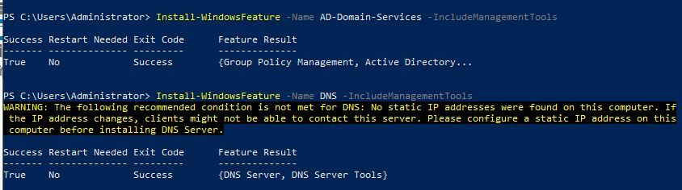

**Step 2:** Configure DNS for for AD DS

**Step 2.1:** Create a Foward Lookup Zone
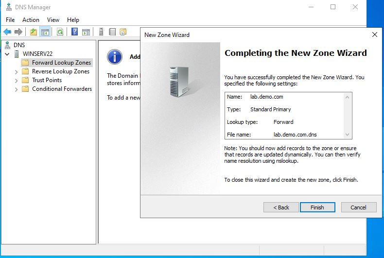

**Step 2.2:** Create a Reverse Lookup Zone
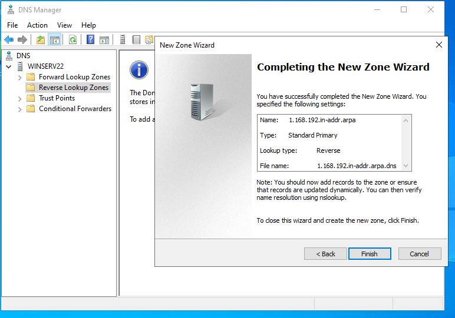

**Step 2.3:** Configure Fowarder
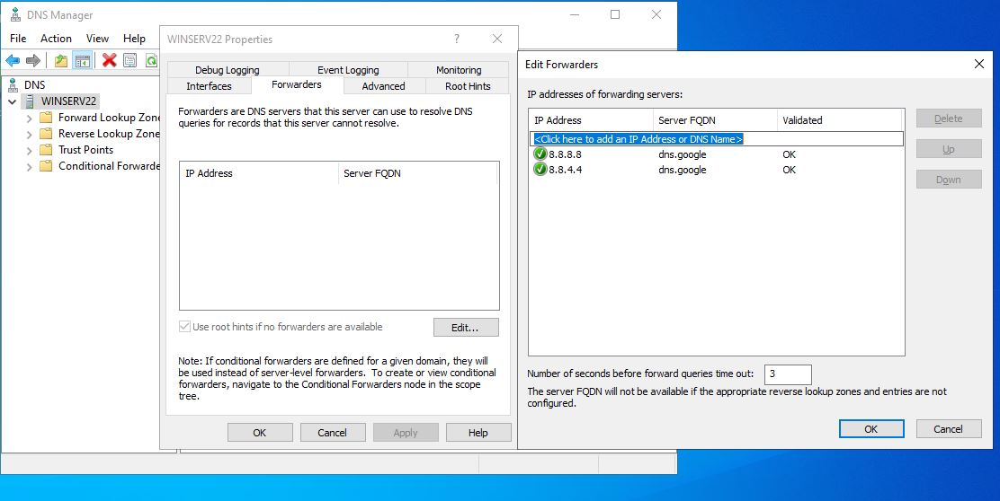

**Step 2.4:** Configure DNS Interfaces
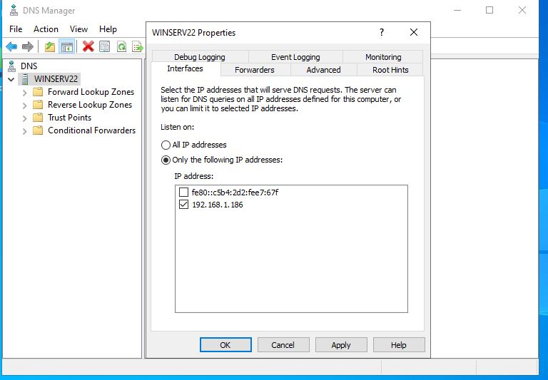

**Step 2.5:** Create the Server's Host A Record
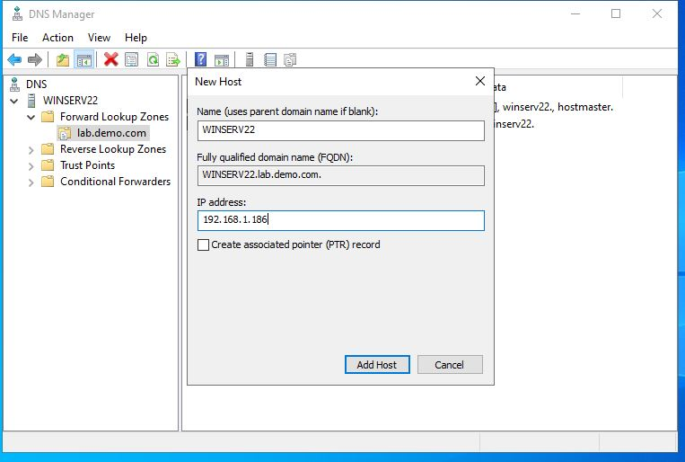

**Step 2.6:** Configure Name Servers

**Step 2.7.1:** Configure Name Server Forward Lookup Zone
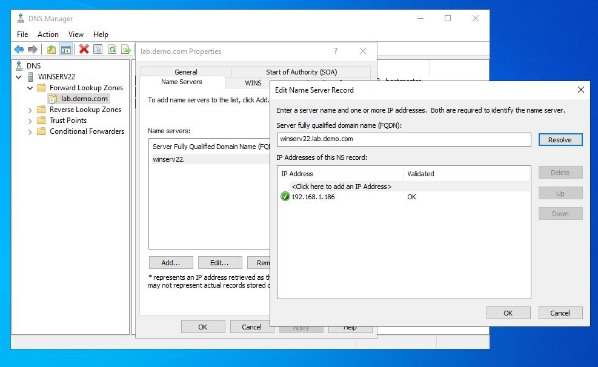

**Step 2.7.2:** Configure Name Server Reverse Lookup Zone
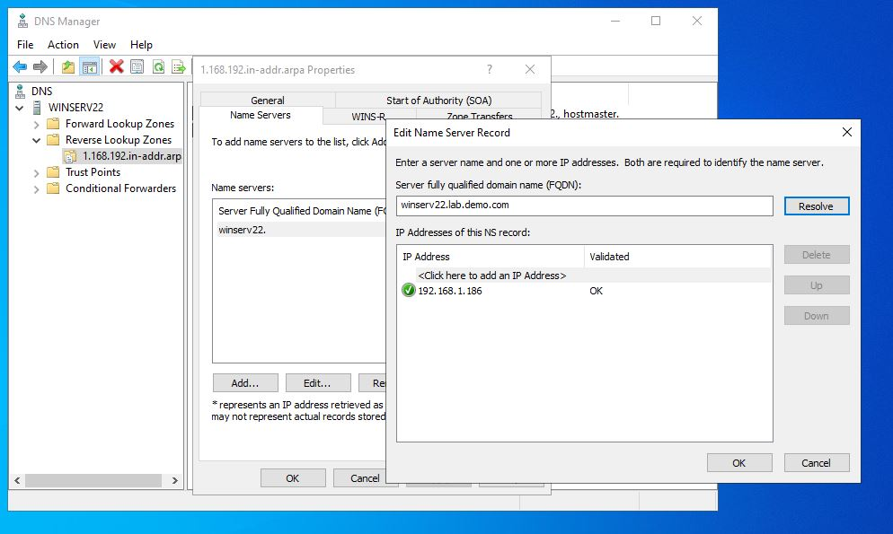

**Step 3:** Create Active Directory Domain
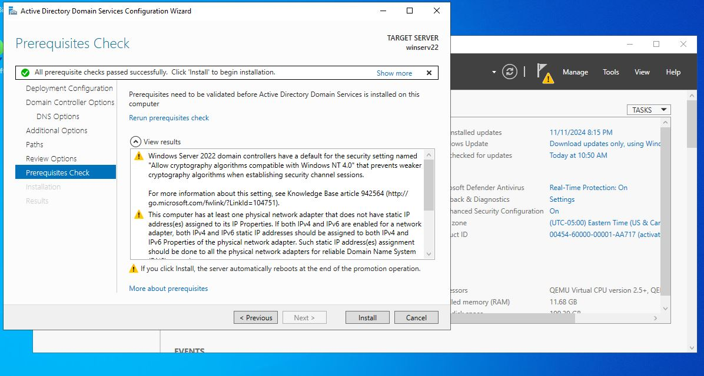

**Step 4:** Reconfigure the DNS Forward Zone
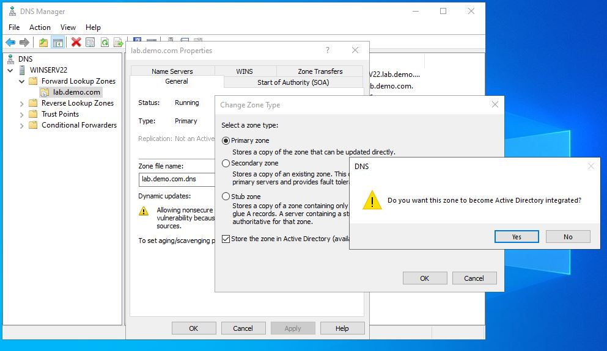

**Step 4.1:** Reconfigure the DNS Reverse Zone
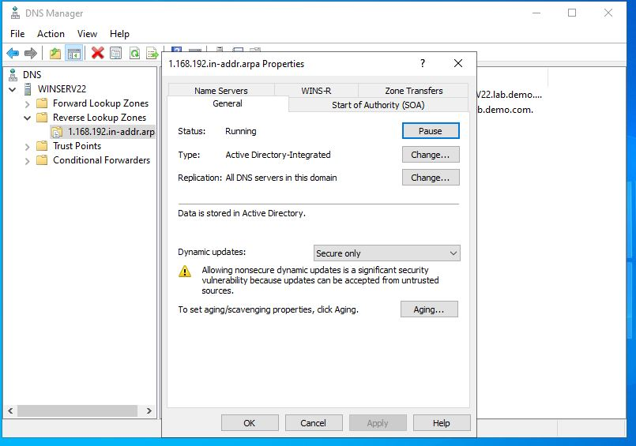

**Step 5:** Disable IPv6 on the net adapter
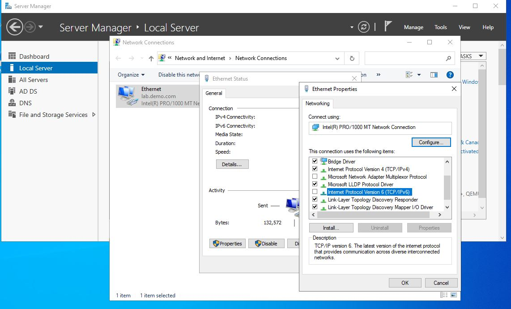

**Step 6:** Add the Domain to the DNS Zone
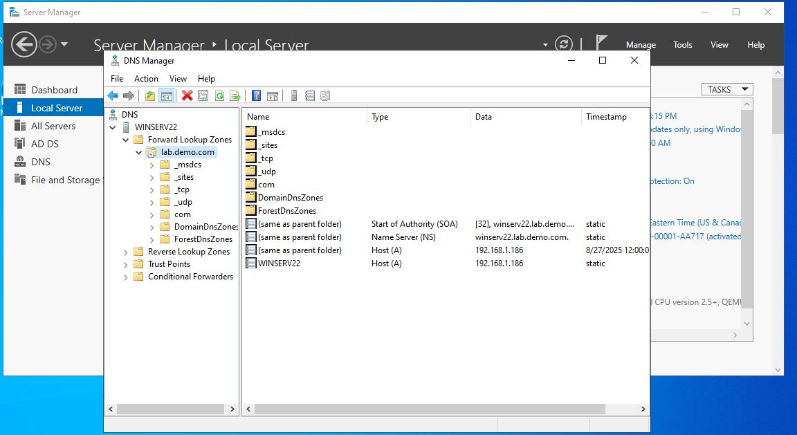

---

## 🐞 Troubleshooting & Issues
- **Issue:** [Describe a problem you ran into, e.g., client could not join domain]  
- **Diagnosis:** [How you investigated, e.g., checked DNS settings, reviewed event logs]  
- **Solution:** [What you did to fix it, e.g., corrected DNS forwarder]  

---

## ✅ Key Takeaways
- [What did you learn from this project?]
- [How does this skill connect to IT support tasks?]
- [Anything you’d do differently next time?]

---
